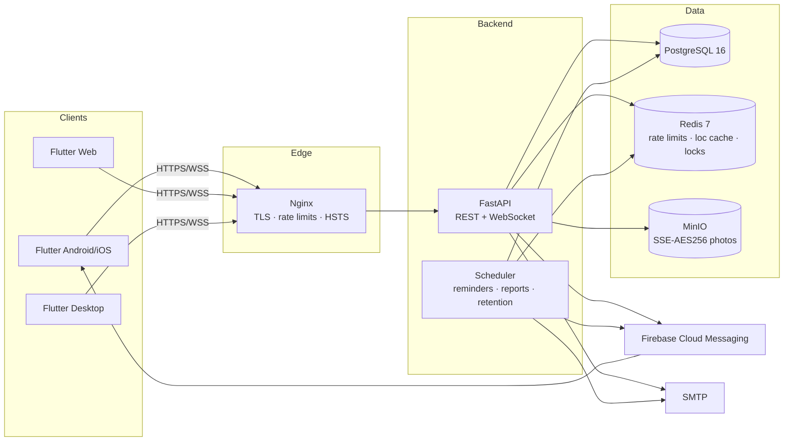
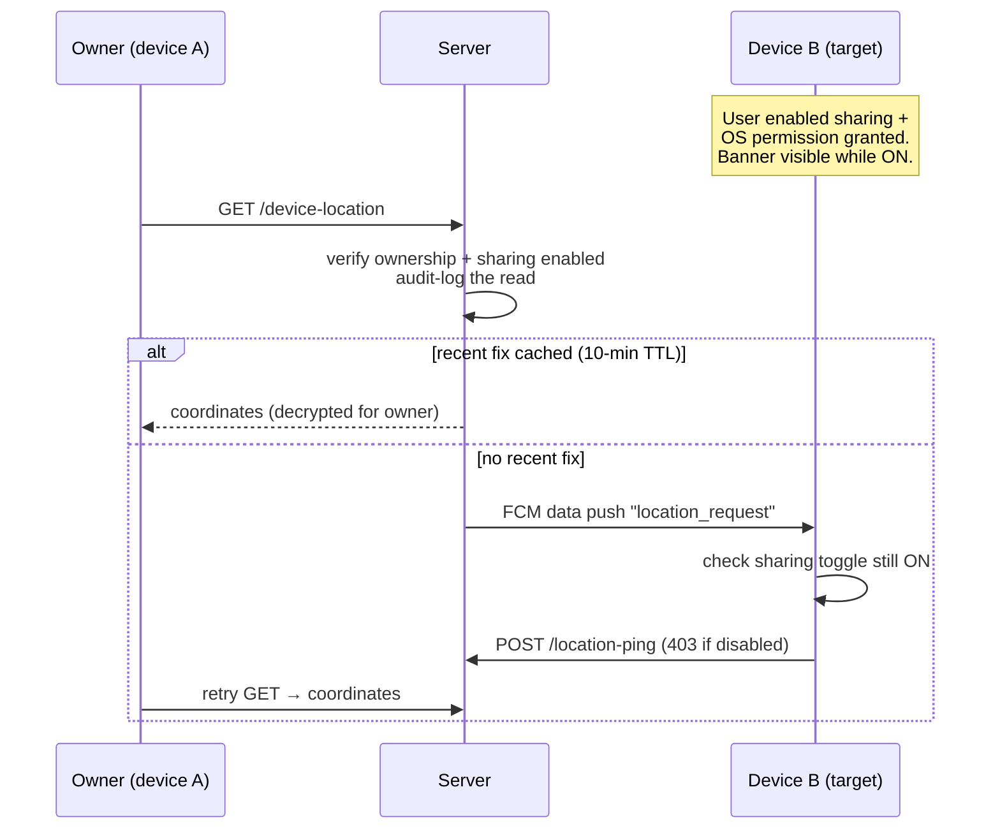
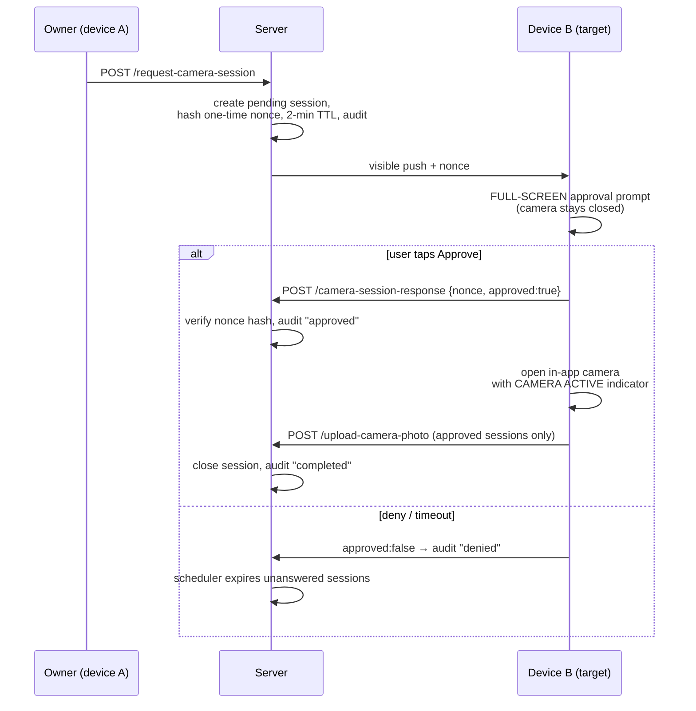
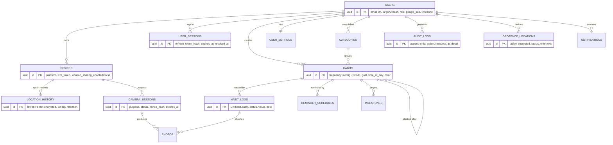

# Architecture

## System diagram

## Consent flows

### Find My Device

### Remote camera

## ER diagram

## Key decisions

- **Offline-first client**: SQLite cache is the read model; writes mark rows
  dirty and sync when connectivity returns. Server-side `(habit_id, log_date)`
  upsert makes sync idempotent.
- **Refresh rotation with reuse detection**: each refresh invalidates the prior
  token; presenting a stale one kills the whole session (theft signal).
- **Privacy enforced server-side**: the location/camera rules live in the API,
  not the UI — a modified client still cannot read a paused device's location
  or upload without an approved session.
- **Encryption layers**: TLS in transit; Fernet for coordinates at rest;
  SSE-AES256 for photo objects; Argon2id for passwords; SHA-256 for token/nonce
  storage (only hashes persisted).
- **Horizontal scale**: stateless API replicas behind nginx; Redis locks keep
  the scheduler single-firing across replicas.
